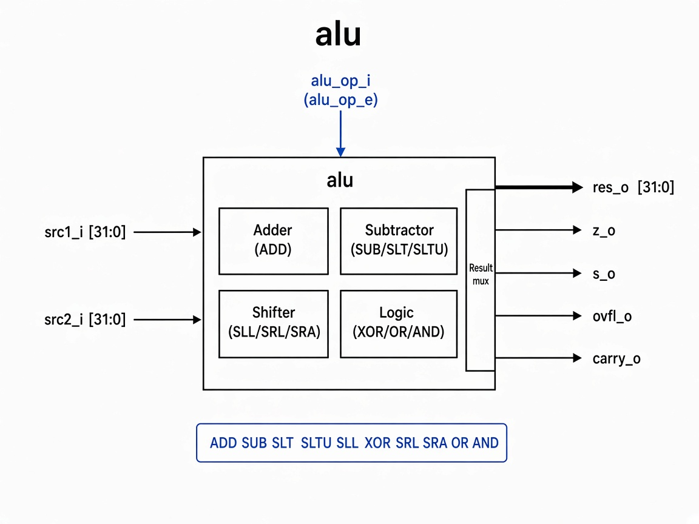

# `alu`: Arithmetic Logic Unit

Combinational 32-bit ALU that computes the result and status flags for RISC-V ALU ops.

## RTL diagram

## Operation table

| `alu_op_i` | Value  | Result `res_o`                         | Flags                          |
|------------|--------|----------------------------------------|--------------------------------|
| `ALU_ADD`  | `4'd0` | `src1 + src2`                          | `carry_o`, `ovfl_o`            |
| `ALU_SUB`  | `4'd1` | `src1 - src2`                          | `carry_o`, `ovfl_o`            |
| `ALU_SLT`  | `4'd2` | `1` if signed `src1 < src2`, else `0`  | —                              |
| `ALU_SLTU` | `4'd3` | `1` if unsigned `src1 < src2`, else `0`| —                              |
| `ALU_SLL`  | `4'd4` | `src1 << src2[4:0]`                    | —                              |
| `ALU_XOR`  | `4'd5` | `src1 ^ src2`                          | —                              |
| `ALU_SRL`  | `4'd6` | `src1 >> src2[4:0]` (logical)          | —                              |
| `ALU_SRA`  | `4'd7` | `src1 >>> src2[4:0]` (arithmetic)      | —                              |
| `ALU_OR`   | `4'd8` | `src1 \| src2`                         | —                              |
| `ALU_AND`  | `4'd9` | `src1 & src2`                          | —                              |
| default    | other  | `src2`                                 | —                              |

Always driven from `res_o`:

| Flag    | Meaning              |
|---------|----------------------|
| `z_o`   | `res_o == 0`         |
| `s_o`   | `res_o[31]` (sign)   |
