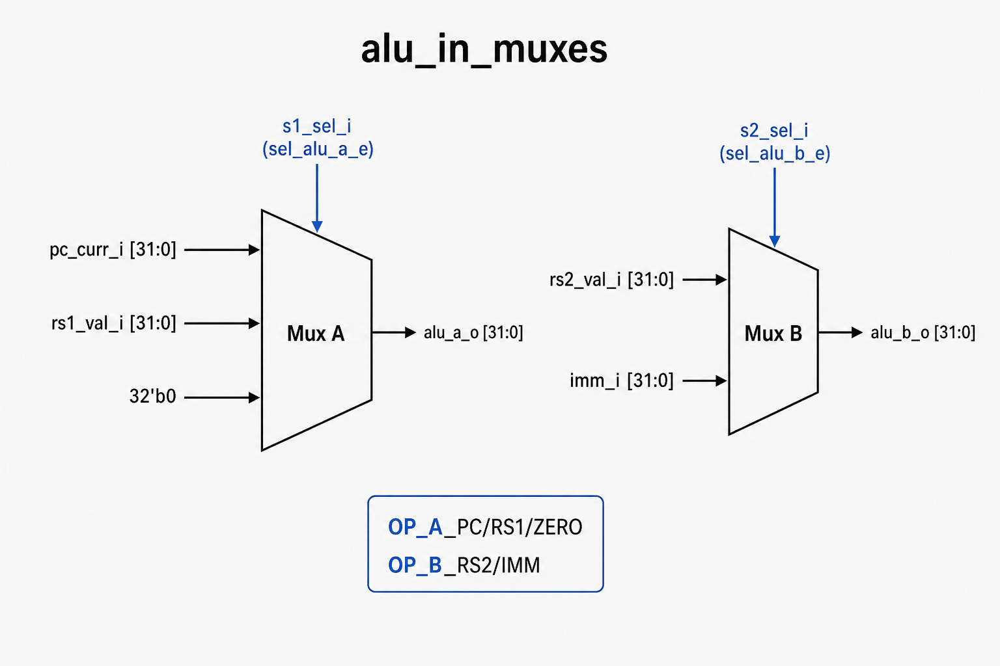

# `alu_in_muxes`: ALU Input Multiplexers

Two combinational muxes that choose the **A** and **B** operands fed into the ALU.

## RTL diagram

## Select tables

### Mux A → `alu_a_o`

| `s1_sel_i`  | Value   | Output `alu_a_o` | Typical use          |
|-------------|---------|------------------|----------------------|
| `OP_A_PC`   | `2'b00` | `pc_curr_i`      | `auipc`, PC-relative |
| `OP_A_RS1`  | `2'b01` | `rs1_val_i`      | `add`, `addi`, …     |
| `OP_A_ZERO` | `2'b10` | `0`              | special / zero op A  |
| default     | other   | `0`              | invalid / unused     |

### Mux B → `alu_b_o`

| `s2_sel_i` | Value  | Output `alu_b_o` | Typical use        |
|------------|--------|------------------|--------------------|
| `OP_B_RS2` | `1'b0` | `rs2_val_i`      | `add`, `sub`, …    |
| `OP_B_IMM` | `1'b1` | `imm_i`          | `addi`, `lw`, …    |

## Files

| File | Role |
|------|------|
| `alu_in_muxes.sv` | SystemVerilog hardware |
| `alu_in_muxes_uarch.py` | Python golden model |
| `python_stimulus_alu_in_muxes.py` | cocotb tests |
| `Makefile` | compile + simulate with Icarus |
| `../cpu_sv_package.sv` | shared enums (`sel_alu_a_e`, `sel_alu_b_e`) |

