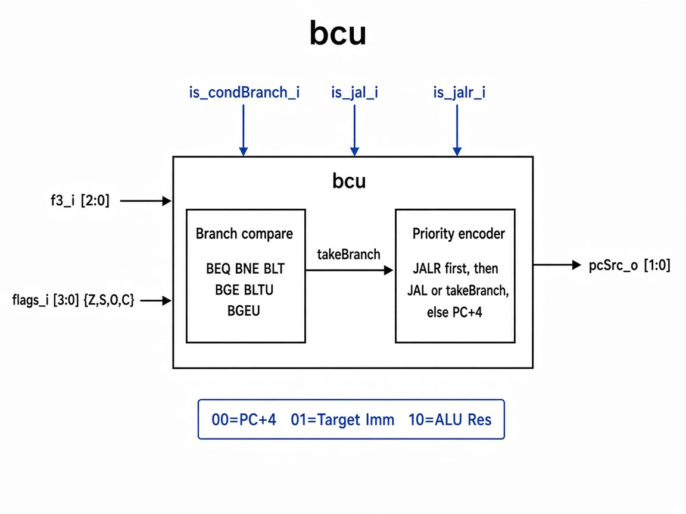

# `bcu`: Branch Control Unit

Combinational unit that decides the next-PC source for conditional branches, `jal`, and `jalr`.

## RTL diagram

## Branch compare (`is_cond_branch_i = 1`)

| `f3_i`   | Instr  | `take_branch` when          |
|----------|--------|-----------------------------|
| `3'b000` | `beq`  | `Z = 1`                     |
| `3'b001` | `bne`  | `Z = 0`                     |
| `3'b100` | `blt`  | `S != O`                    |
| `3'b101` | `bge`  | `S == O`                    |
| `3'b110` | `bltu` | `C = 0`                     |
| `3'b111` | `bgeu` | `C = 1`                     |
| default  | —      | `0`                         |

`flags_i = {Z, S, O, C}` from the ALU.

## `pc_src_o` priority

| Priority | Condition                         | `pc_src_o` | Next PC      |
|----------|-----------------------------------|------------|--------------|
| 1        | `is_jalr_i`                       | `2'b10`    | ALU result   |
| 2        | `is_jal_i` or `take_branch`       | `2'b01`    | target imm   |
| 3        | else                              | `2'b00`    | PC + 4       |
