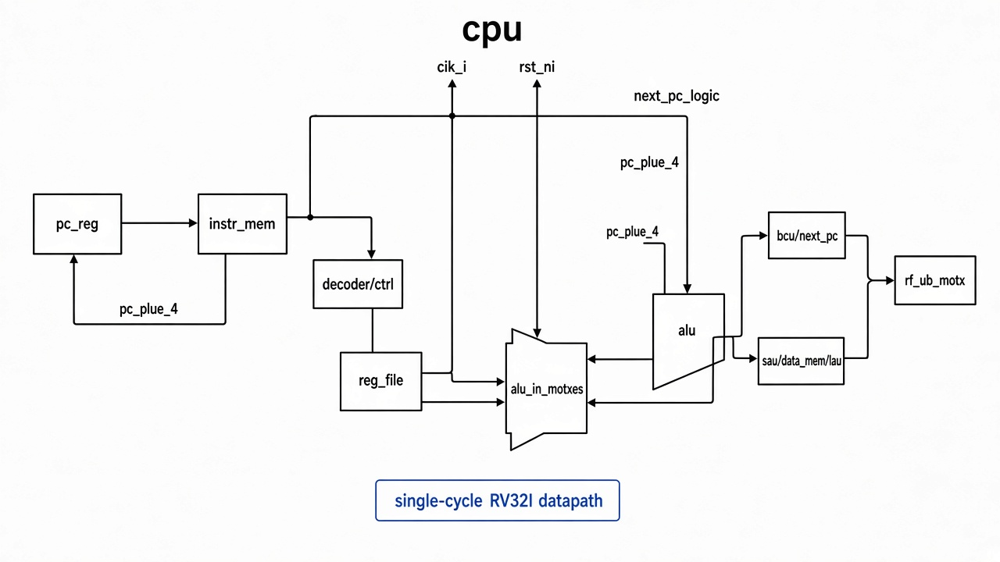

# `cpu`: Top-Level Core

Single-cycle RISC-V RV32I core that wires fetch, decode, execute, memory, and write-back blocks together.

## RTL diagram

## Pipeline stages (combinational paths)

| Stage | Blocks |
|-------|--------|
| Fetch | `pc_reg`, `pc_plus_4`, `instr_mem_wrapper`, `next_pc_logic` |
| Decode | `decoder`, `ctrl`, `reg_file` |
| Execute | `alu_in_muxes`, `alu`, `bcu` |
| Memory | `sau`, `data_mem_wrapper`, `lau` |
| Write-back | `rf_wb_mux` → `reg_file` |

## Ports

| Signal | Role |
|--------|------|
| `clk_i` | system clock |
| `rst_ni` | active-low reset (clears PC) |
