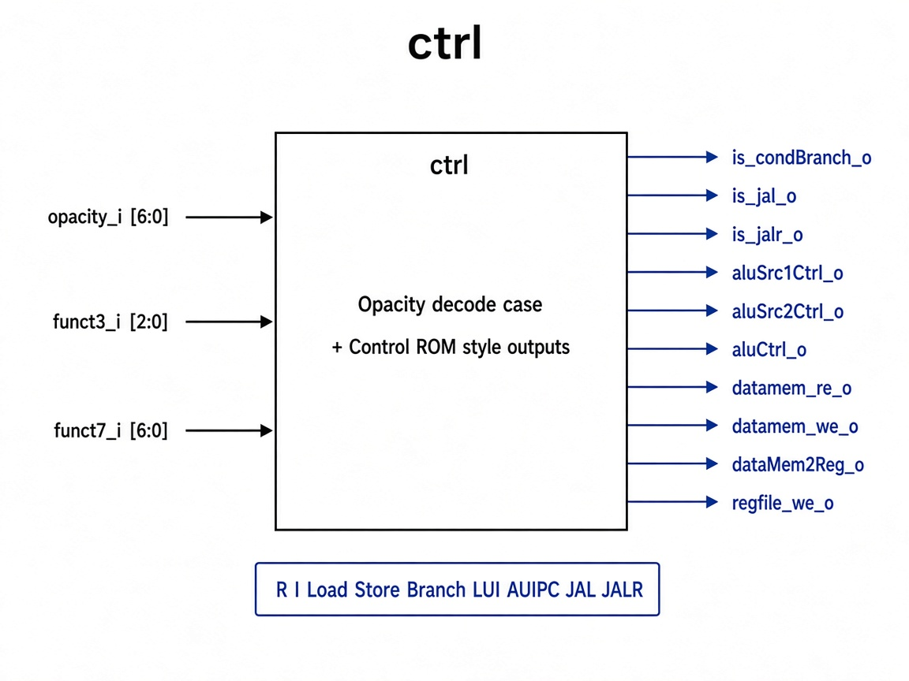

# `ctrl`: Control Unit

Combinational decoder that turns opcode / funct3 / funct7 into datapath control signals.

## RTL diagram

## Opcode → control

| Opcode | Hex | Key controls |
|--------|-----|--------------|
| R-type | `0x33` | `regfile_we`, ALU op from `funct3`/`funct7` |
| I-ALU | `0x13` | `regfile_we`, `alu_src2=Imm`, ALU op from `funct3`/`funct7` |
| Load | `0x03` | `regfile_we`, `alu_src2=Imm`, `datamem_re`, `wb=LAU` |
| Store | `0x23` | `alu_src2=Imm`, `datamem_we` |
| Branch | `0x63` | `is_cond_branch`, `alu_ctrl=SUB` |
| LUI | `0x37` | `regfile_we`, `alu_src1=Zero`, `alu_src2=Imm` |
| AUIPC | `0x17` | `regfile_we`, `alu_src1=PC`, `alu_src2=Imm` |
| JALR | `0x67` | `is_jalr`, `regfile_we`, `wb=PC+4` |
| JAL | `0x6F` | `is_jal`, `regfile_we`, `wb=PC+4` |

## Select encodings

| Signal | Encoding |
|--------|----------|
| `alu_src1_ctrl_o` | `0=PC`, `1=RS1`, `2=Zero` |
| `alu_src2_ctrl_o` | `0=RS2`, `1=Imm` |
| `dataMem2Reg_o` | `0=ALU`, `1=DataMem/LAU`, `2=PC+4` |
| `alu_ctrl_o` | same as `alu_op_e` (`ADD`…`AND`) |
