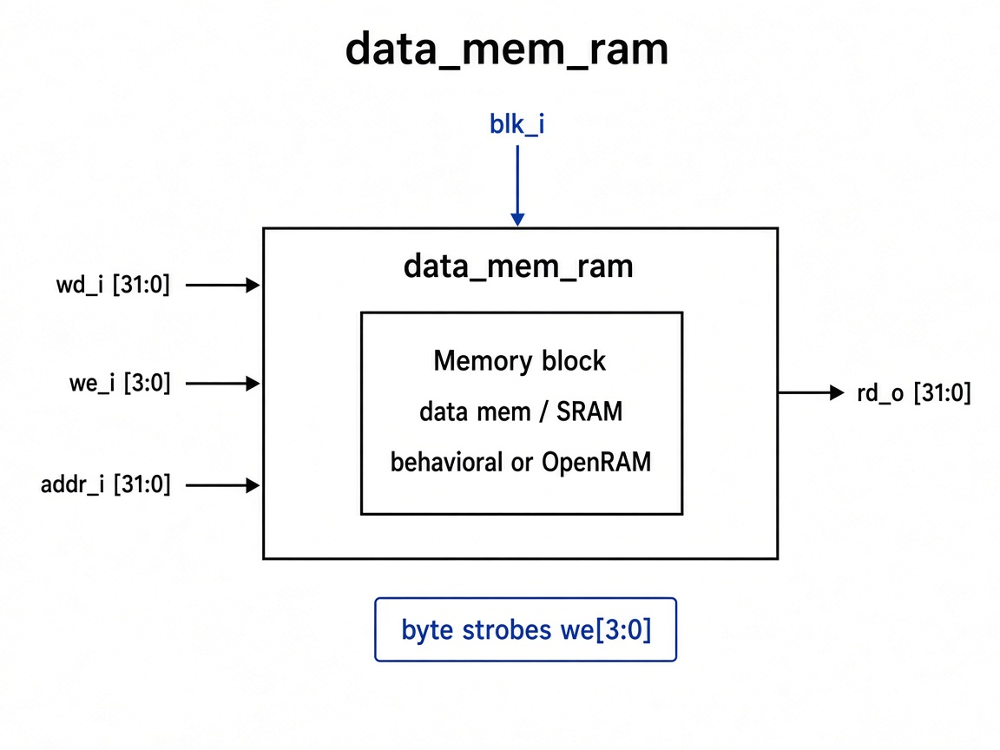

# `data_mem_wrapper`: Data Memory Wrapper

Thin wrapper around data memory: behavioral model in sim, OpenRAM macro when `USE_OPENRAM` is defined.

## RTL diagram

## Ports

| Signal | Role |
|--------|------|
| `clk_i` | memory clock |
| `we_i [3:0]` | byte-write strobes |
| `addr_i [31:0]` | address |
| `wd_i [31:0]` | write data |
| `rd_o [31:0]` | read data |

## Backends

| Mode | Instance | Notes |
|------|----------|-------|
| default | `data_mem_behavioral` | byte strobes via `we_i` |
| `USE_OPENRAM` | `sram_4kb_32b_openram` | `web0=~(|we_i)`, `wmask0=we_i`, `addr=addr[11:2]` |
