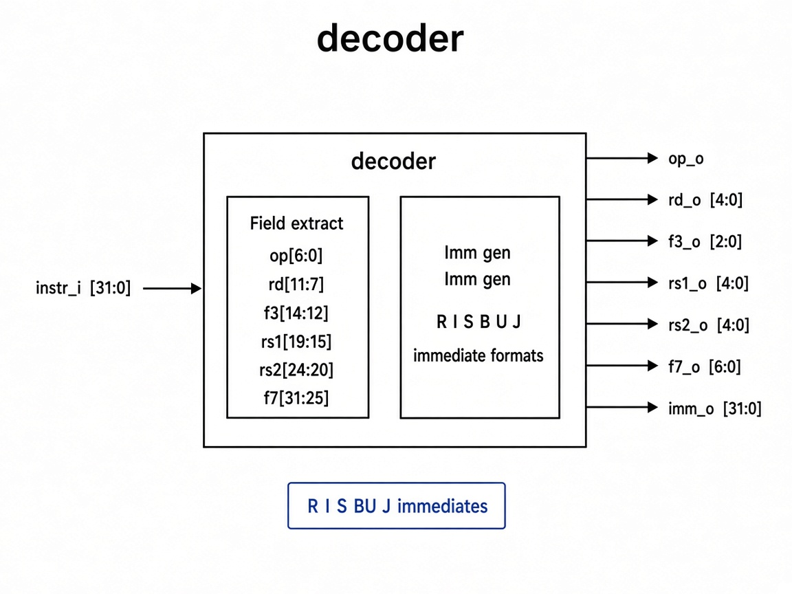

# `decoder`: Instruction Decoder

Combinational unit that extracts instruction fields and sign-/zero-extends the immediate based on opcode.

## RTL diagram

## Field extract

| Output   | Bits            |
|----------|-----------------|
| `op_o`   | `instr_i[6:0]`  |
| `rd_o`   | `instr_i[11:7]` |
| `f3_o`   | `instr_i[14:12]`|
| `rs1_o`  | `instr_i[19:15]`|
| `rs2_o`  | `instr_i[24:20]`|
| `f7_o`   | `instr_i[31:25]`|

## Immediate generation (`imm_o`)

| Opcode | Types | `imm_o` |
|--------|-------|---------|
| `OPCODE_R_TYPE` | R | `0` |
| `OPCODE_I_TYPE_ALU`, `OPCODE_I_TYPE_LOAD`, `OPCODE_I_TYPE_JALR` | I | sign-extend `instr[31:20]` |
| `OPCODE_S_TYPE` | S | sign-extend `{instr[31:25], instr[11:7]}` |
| `OPCODE_B_TYPE` | B | sign-extend `{instr[31], instr[7], instr[30:25], instr[11:8], 1'b0}` |
| `OPCODE_U_TYPE_LUI`, `OPCODE_U_TYPE_AUIPC` | U | `{instr[31:12], 12'b0}` |
| `OPCODE_J_TYPE` | J | sign-extend `{instr[31], instr[19:12], instr[20], instr[30:21], 1'b0}` |
| default | — | `0` |
