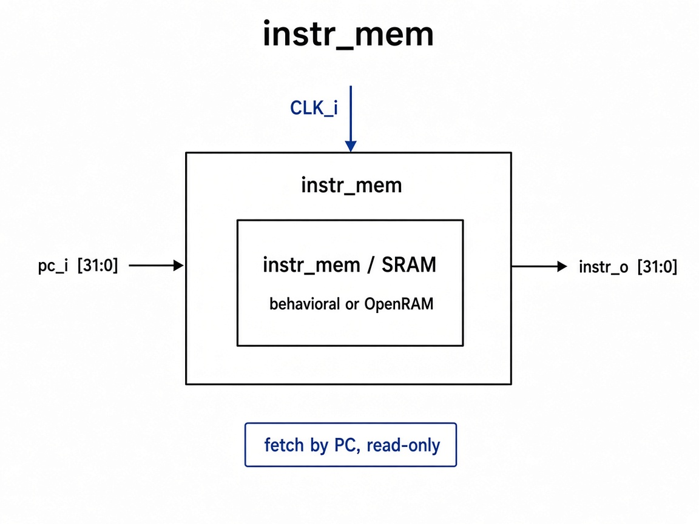

# `instr_mem_wrapper`: Instruction Memory Wrapper

Thin wrapper around instruction memory: behavioral model in sim, OpenRAM macro when `USE_OPENRAM` is defined.

## RTL diagram

## Ports

| Signal | Role |
|--------|------|
| `pc_i [31:0]` | fetch address |
| `instr_o [31:0]` | fetched instruction |
| `clk_i` | only when `USE_OPENRAM` |

## Backends

| Mode | Instance | Notes |
|------|----------|-------|
| default | `instr_mem_behavioral` | word-addressed by `pc` |
| `USE_OPENRAM` | `sram_4kb_32b_openram` | read-only (`web0=1`), `addr=pc[11:2]` |
