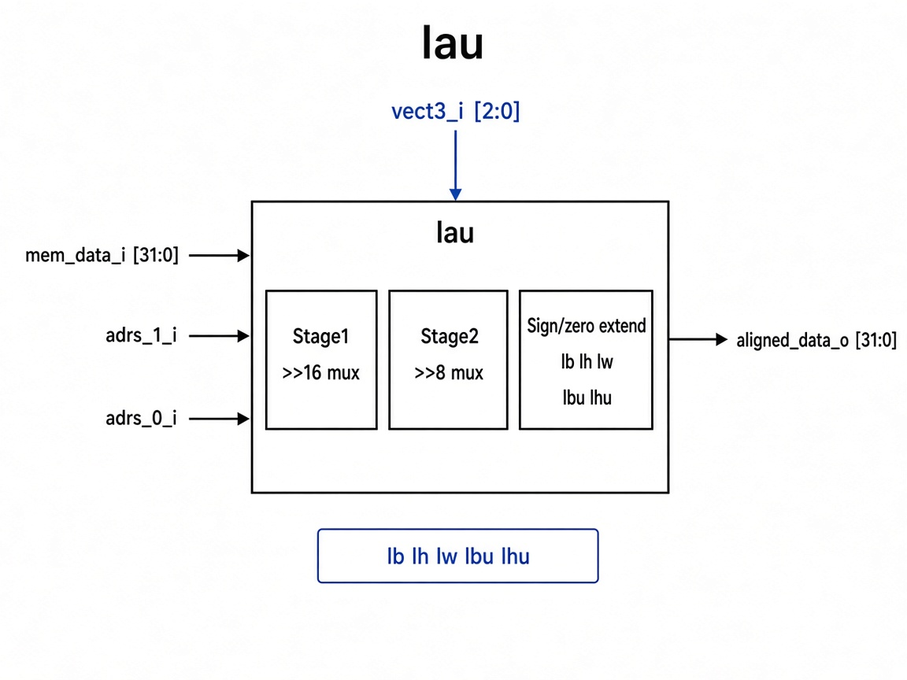

# `lau`: Load Alignment Unit

Combinational unit that shifts loaded memory data onto the low bytes and sign-/zero-extends for `lb` / `lh` / `lw` / `lbu` / `lhu`.

## RTL diagram

## Alignment shifts

| Step | Condition | Action |
|------|-----------|--------|
| Stage 1 | `adrs_1_i` | `mem_data_i >> 16` else pass |
| Stage 2 | `adrs_0_i` | stage1 `>> 8` else pass |

## Operation table

| `funct3_i` | Instr | `aligned_data_o` |
|------------|-------|------------------|
| `3'b000` | `lb`  | sign-extend byte |
| `3'b001` | `lh`  | sign-extend halfword |
| `3'b010` | `lw`  | full word |
| `3'b100` | `lbu` | zero-extend byte |
| `3'b101` | `lhu` | zero-extend halfword |
| default  | —     | `0` |
