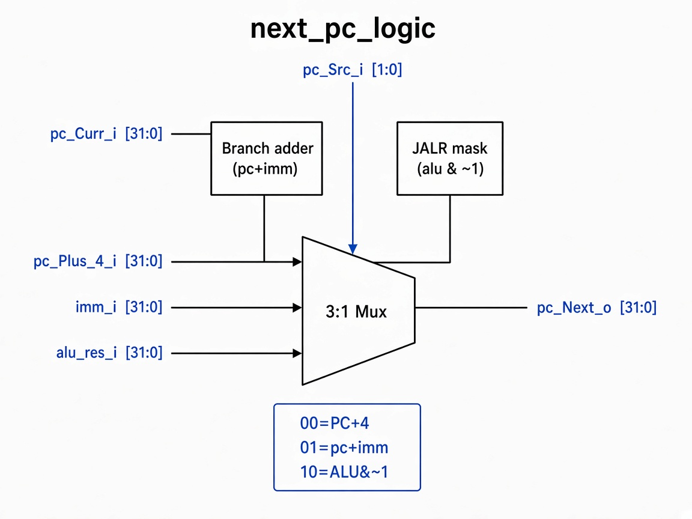

# `next_pc_logic`: Next-PC Mux

Combinational unit that picks the next PC from PC+4, a branch/JAL target, or a JALR target.

## RTL diagram

## Select table

| `pc_src_i` | Value  | `pc_next_o` | Typical use |
|------------|--------|-------------|-------------|
| fallthrough | `2'b00` | `pc_plus_4_i` | sequential |
| target imm | `2'b01` | `pc_curr_i + imm_i` | branch, `jal` |
| ALU res | `2'b10` | `alu_res_i & ~1` | `jalr` (LSB cleared) |
| default | other | `pc_plus_4_i` | safe fallthrough |
