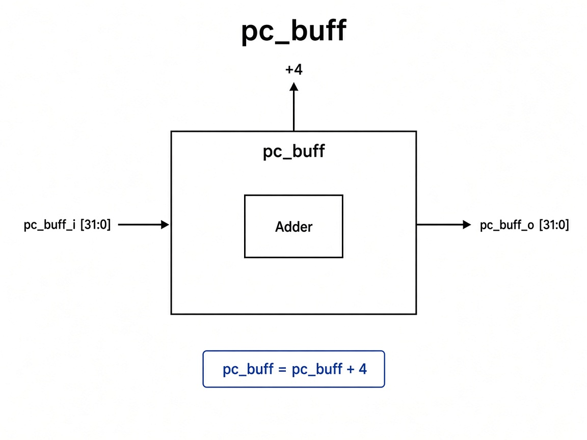

# `pc_plus_4`: PC Incrementer

Combinational adder that always computes the sequential next address.

## RTL diagram

## Function

| Input | Output |
|-------|--------|
| `pc_curr_i` | `pc_plus_4_o = pc_curr_i + 4` |
