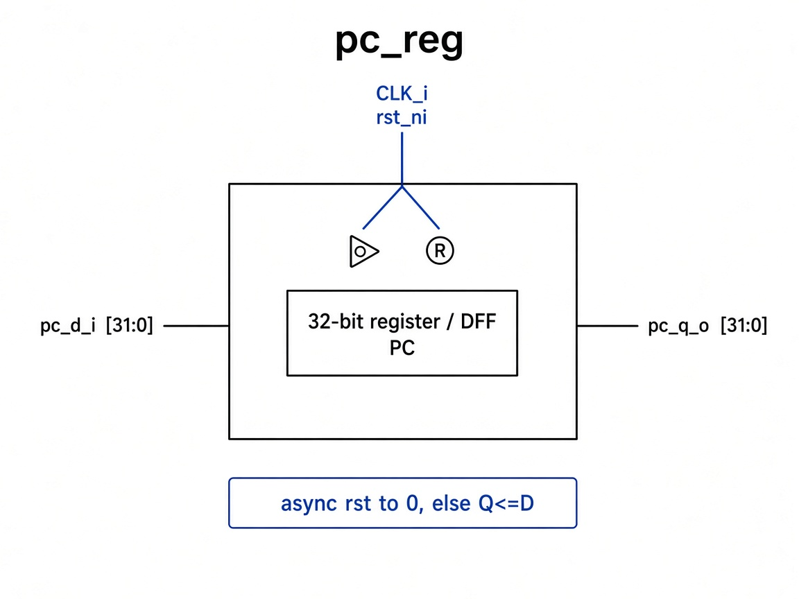

# `pc_reg`: Program Counter Register

32-bit register that holds the current PC. Active-low async reset to `0`.

## RTL diagram

## Behavior

| Condition | `pc_q_o` |
|-----------|----------|
| `rst_ni = 0` | `32'h0` |
| `posedge clk_i` | `pc_d_i` |
