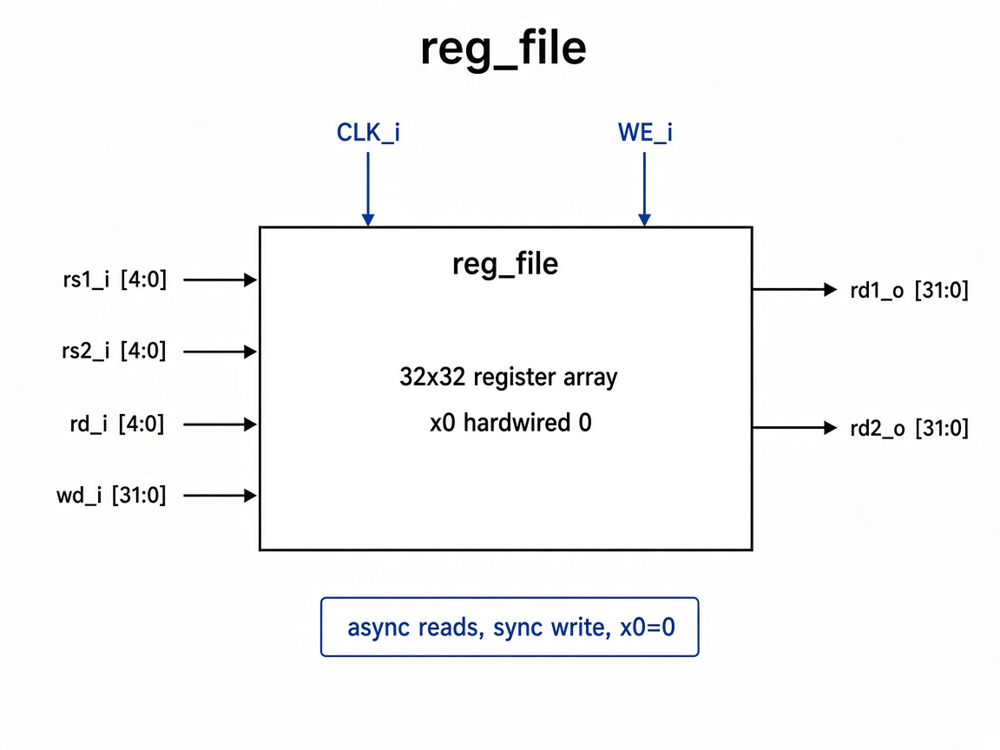

# `reg_file`: Register File

32×32-bit register file with two async reads and one sync write. `x0` is hardwired to zero.

## RTL diagram

## Ports

| Direction | Signal | Role |
|-----------|--------|------|
| in | `rs1_i`, `rs2_i` | read addresses |
| out | `rd1_o`, `rd2_o` | read data |
| in | `rd_i`, `wd_i`, `we_i` | write port |
| in | `clk_i` | write clock |

## Behavior

| Path | Rule |
|------|------|
| Read | `rd*_o = 0` if `rs*_i == 0`, else `registers[rs*_i]` |
| Write | on `posedge clk_i` if `we_i && rd_i != 0`: `registers[rd_i] <= wd_i` |
