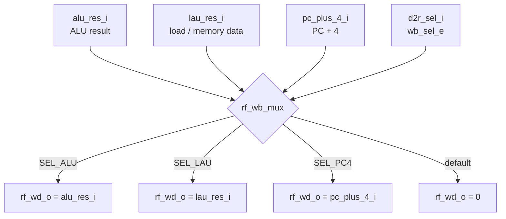

# `rf_wb_mux`: Register-File Write-Back Multiplexer

3 to 1 combinational mux that chooses what gets written to the register file after an instruction finishes

## RTL diagram

## Flowchart

## Select table

| `d2r_sel_i` | Value   | Output `rf_wd_o` | Typical use        |
|-------------|---------|------------------|--------------------|
| `SEL_ALU`   | `2'b00` | `alu_res_i`      | `add`, `addi`, …   |
| `SEL_LAU`   | `2'b01` | `lau_res_i`      | `lw`, `lb`, …      |
| `SEL_PC4`   | `2'b10` | `pc_plus_4_i`    | `jal`, `jalr`      |
| default     | other   | `0`              | invalid / unused   |

## Files

| File | Role |
|------|------|
| `rf_wb_mux.sv` | SystemVerilog hardware |
| `python_stimulus_rf_wb_mux.py` | cocotb tests |
| `Makefile` | compile + simulate with Icarus |
| `../cpu_sv_package.sv` | shared enums (`wb_sel_e`) |

