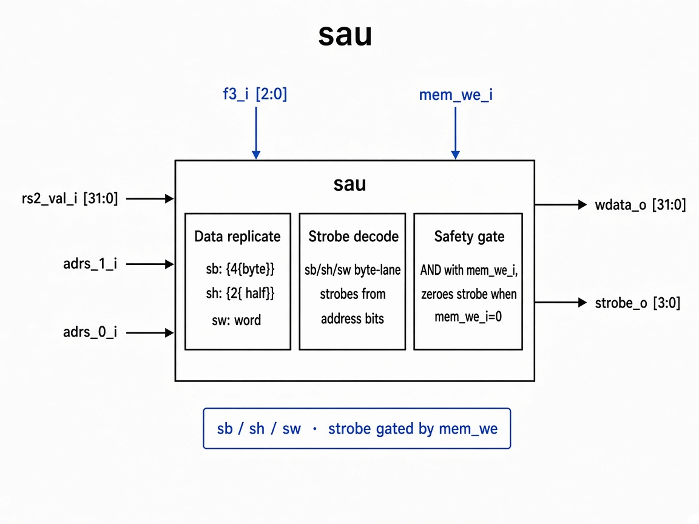

# `sau`: Store Alignment Unit

Combinational unit that replicates store data onto the correct byte lanes and generates the write strobe for `sb` / `sh` / `sw`.

## RTL diagram

## Operation table

| `f3_i` | Instr | `wdata_o`                         | `raw_strobe`                                      |
|--------|-------|-----------------------------------|---------------------------------------------------|
| `3'b000` | `sb`  | `{4{rs2_val_i[7:0]}}`             | `4'b0001 << {adrs_1_i, adrs_0_i}`                  |
| `3'b001` | `sh`  | `{2{rs2_val_i[15:0]}}`            | `4'b0011` if `adrs_1_i=0`, else `4'b1100`         |
| `3'b010` | `sw`  | `rs2_val_i`                       | `4'b1111`                                         |
| default  | —     | `rs2_val_i`                       | `4'b0000`                                         |

## Safety gate

| `mem_we_i` | `strobe_o`   |
|------------|--------------|
| `1`        | `raw_strobe` |
| `0`        | `4'b0000`    |
